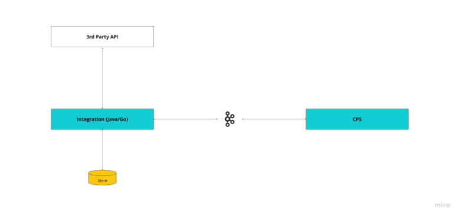

# Tanda Daraja Integration

This project demonstrates how to consume Kafka messages and process them using a Spring Boot application. It includes a `KafkaConsumerService` that listens to Kafka messages, deserializes them, and invokes a third-party payment service.

## Getting Started

### Prerequisites

- Java 11 or higher (Preferably Java 17)
- Apache Kafka
- Maven
- Docker

### Running the application

1. Clone the application
``git clone <repository-url>``
2. Change the directory to the application's directory
``cd tanda-daraja-integration``
3. Build the project using Maven.
``mvn clean install``
4. Run the application
``mvn spring-boot:run``

### System Architecture
This is the architecture of this application. It sits in between the Tanda Core Payment System (CPS) and the Daraja B2C API.

This `README.md` file provides clear instructions on setting up the project, and running the application, and running the tests.